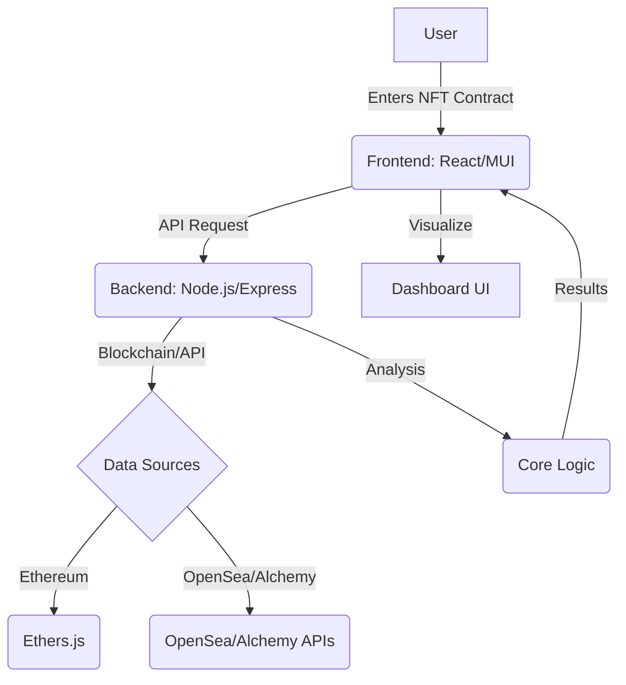

# 🚀 NFT Smart Contract Analysis Dashboard


> **A next-generation, AI-powered dashboard for analyzing NFT smart contracts, trust, risk, price, fraud, and portfolio data.**

---

## 🌌 Vision

Welcome to the **NFT Smart Contract Analysis Dashboard** — a flagship, open-source platform designed to redefine how the world understands, trusts, and interacts with NFTs. Built for collectors, investors, analysts, and visionaries, this dashboard delivers unparalleled insights, security, and transparency for the decentralized future.

---

## ✨ Features

- **NFT Details:** Instantly fetch and visualize NFT contract metadata with stunning clarity.
- **Trust Score:** AI-driven trust and risk scoring for any NFT contract, visualized in real time.
- **Price & Market Data:** Live price, volume, floor, and historical charts with interactive analytics.
- **Risk Analysis:** Deep-dive into contract security, volatility, and ownership concentration.
- **Fraud Detection:** Automated detection of suspicious activity, fake volume, and market manipulation.
- **Collection & Portfolio:** Explore collection stats and manage your NFT portfolio with advanced tools.
- **Live Updates:** Real-time polling and data refresh for always up-to-date intelligence.
- **Modern UI/UX:** Crafted with React, MUI, and next-gen data visualizations for a seamless experience.
- **Modular & Extensible:** Built for customization, integration, and future-proofing.

---

## 🏗️ Architecture



```
DataExtraction2/
├── backend/         # Node.js/Express API for NFT analysis
├── frontend/        # React + MUI dashboard UI
├── src/             # Core analysis logic, blockchain, and services
├── public/          # Static assets
└── ...
```

---

## 🚦 Quick Start

### 1. Clone the Repository
```bash
git clone https://github.com/PushkarPrabhath27/NFT_TrustScore.git
cd DataExtraction
```

### 2. Install Dependencies
```bash
npm install
cd frontend
npm install
```

### 3. Start the Backend (API)
```bash
cd .. # Ensure you are in DataExtraction
npm start
```

### 4. Start the Frontend (Dashboard)
```bash
cd frontend
npm start
```

### 5. Analyze Your NFT Contract
- Open your browser at [http://localhost:3000](http://localhost:3000)
- Enter your NFT contract address and hit **Analyze**
- Explore the dashboard with live, interactive, and visually stunning insights!

---

## 🖼️ Screenshots & Diagrams

> _Replace these with your own project screenshots!_

| NFT Overview | Trust Score & Risk | Price History |
|--------------|-------------------|--------------|
|  |  |  |

---

## 🛠️ Tech Stack

- **Frontend:** React, Material-UI, Recharts, Framer Motion, Zustand
- **Backend:** Node.js, Express, Ethers.js, OpenSea/Alchemy APIs
- **Visualization:** Recharts, ApexCharts, MUI Cards
- **Testing:** Jest, React Testing Library
- **CI/CD:** GitHub Actions (recommended)

---

## 🧠 Advanced Usage

- **Custom Analysis:** Plug in your own analysis modules in `src/` for new metrics.
- **API Integration:** Extend backend endpoints for new data sources or blockchains.
- **Theming:** Easily switch between light/dark and custom themes with MUI.
- **Real-Time Data:** Built-in polling and WebSocket-ready for live updates.

---

## 🤝 Contributing

We welcome contributions from the community! Please read our [Contributing Guide](CONTRIBUTING.md) and [Code of Conduct](CODE_OF_CONDUCT.md) before submitting issues or pull requests.

---

## 🔒 Security

If you discover a security vulnerability, please see our [Security Policy](SECURITY.md).

---

## 📄 License

This project is licensed under the [MIT License](LICENSE).

---

## 📬 Contact & Community

- **Lead Maintainer:** Pushkar
- **Email:** Pushkarprabhathrayana@gmail.com
- **GitHub Issues:** [Open an Issue](https://github.com/your-repo/nft-analysis-dashboard/issues)
- **Community Chat:** _Coming soon!_

---

> _NFT Smart Contract Analysis Dashboard — Empowering NFT analytics for the next generation of Web3. Built with ❤️ by Pushkar._ 